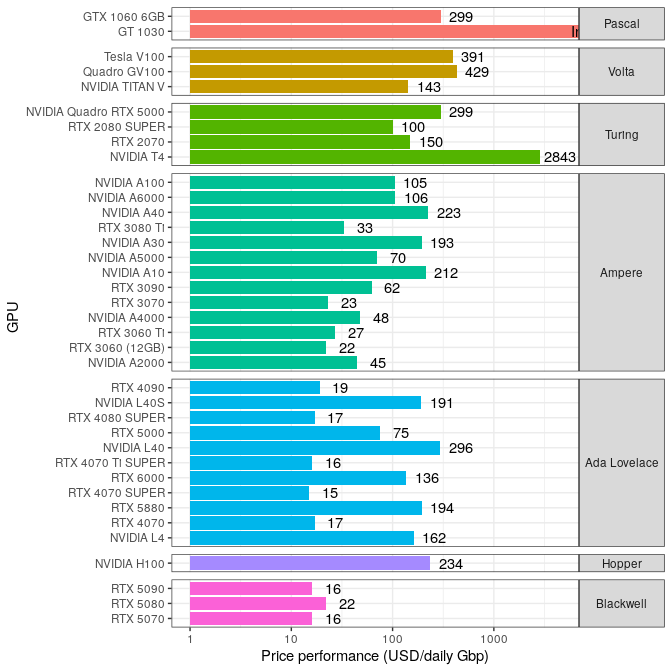

README
================
Rasmus Kirkegaard
11 August, 2025

## Aim

To make it easier to get an overview of the performance you can get for
nanopore basecalling with
[dorado](https://github.com/nanoporetech/dorado) using a specific GPU.

## How to contribute?

- Download some 5khz pod5 data
  ([zenodo](https://zenodo.org/records/15180194)) or ([dropbox (likely
  faster)](https://www.dropbox.com/scl/fi/bpe4rxzst7odp4ia0xo28/basecalling_benchmarks_5khz_pod5s.tar.gz?rlkey=g1w76w3yooabdapycbsqvnln8&st=5u59ad6q&dl=0))
- Download [dorado](https://github.com/nanoporetech/dorado)
- Run basecalling
  `dorado basecaller --device  'cuda:0' sup pod5/ > basecalls.bam`
- Add your samples/s output to [google
  form](https://forms.gle/Qw1wiL662YrbHPxk6)

## Data availability

The collected information is available in [this google
sheet](https://docs.google.com/spreadsheets/d/1p_oqalXtyMomcoeh0CE-crBgxsGifBYMvTR7hHBqmEw/edit?usp=sharing)

## Basecalling performance

The red line indicates the capacity needed to basecall 1 PromethION
flowcell (yielding 150 Gbp/72hours), the blue line 2 flowcells.

<!-- -->

                           
                           
                           

------------------------------------------------------------------------

## Do not calculate the price/performance for your GPUs!!!

For the consumer cards it is easy to get [pricing info from
wikipedia](https://en.wikipedia.org/wiki/List_of_Nvidia_graphics_processing_units).
However, for the data center cards it is more challenging so the numbers
here will not reflect the best deals available and will vary a lot by
region and whether price info is available at all. If someone has a good
source for prices for data center GPUs that would be great. For now I
can only recommend that you do not trust the price/perfomance
calculations as “true” numbers but they might give you a hint that
datacenter GPUs means you have to pay quite a bit more to get the
perfomance you see from consumer grade GPUs.

   

Lower values = more basecalling for your dollars.

<!-- -->
