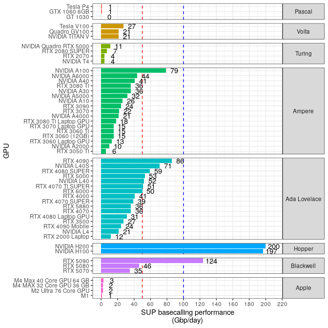

README
================
Rasmus Kirkegaard
16 April, 2025

## Aim

To make it easier to get an overview of the performance you can get for
nanopore basecalling with
[dorado](https://github.com/nanoporetech/dorado) using a specific GPU.

## How to contribute?

- Download some 5khz pod5 data
  ([zenodo](https://zenodo.org/records/15180194))
- Download [dorado](https://github.com/nanoporetech/dorado)
- Run basecalling
  `dorado basecaller --device  'cuda:0' sup pod5/ > basecalls.bam`
- Add your samples/s output to [google
  form](https://forms.gle/Qw1wiL662YrbHPxk6)

## Data availability

The collected information is available in [this google
sheet](https://docs.google.com/spreadsheets/d/1p_oqalXtyMomcoeh0CE-crBgxsGifBYMvTR7hHBqmEw/edit?usp=sharing)

## Basecalling performance

The red line indicates the capacity needed to basecall 1 PromethION
flowcell (yielding 150 Gbp/72hours), the blue line 2 flowcells.

<!-- -->
